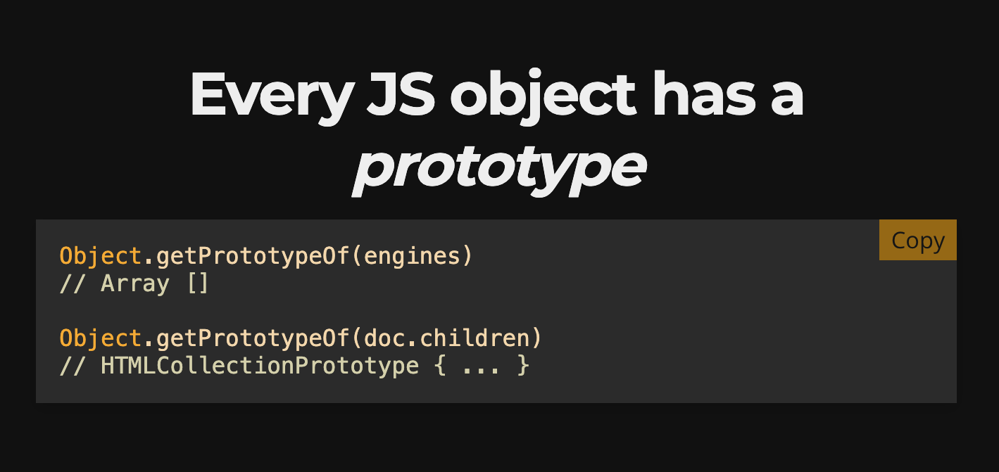

## Prototype



### Object prototype

#### for ... of

```js
const engines = ["V8", "SpiderMonkey"];
for (let eng of engines) {
  console.log(eng.toUpperCase());
}
// V8
// SPIDERMONKEY

const doc = document.documentElement;
for (let child of doc.children) {
  console.log(child.tagName);
}
// HEAD
// BODY
```

#### .map()

```js
engines.map((e) => e.toUpperCase);
// Array ["V8", "SPIDERMONKEY"]

doc.children.map((c) => c.tagName);
// TypeError: doc.children.map is not a function
```

```js
typeof engines;
// "object"

typeof doc.children;
// "object"
```

#### Every JS object has a prototype

```js
Object.getPrototypeOf(engines);
// Array []
Object.getPrototypeOf(doc.children);
// HTMLCollectionPrototype { ... }
```

### Prototype chain

```js
engines.__proto__;
// Array []
engines.__proto__.__proto__;
// Object {}
engines.__proto__.__proto__.__proto__;
// null
```

### Object `hasOwnProperty

```js
const obj = { name: "objectina", isGenie: true };
Object.entries(obj);
// Array [ ["name", "objectina"], ["isGenie", true] ]
obj.toString;
// function toString()
obj.hasOwnProperty("toString");
// false
obj.toString();
// [object Object]
```
