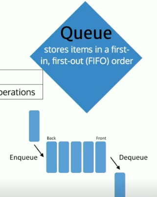

Use Cases

- JavaScript engines have message queue that executes your code at runtime.

```js
class Queue {
  constructor() {
    this._storage = {};
    this._length = 0;
    this._headIndex = 0;
  }
  enqueue(value) {
    // TODO: argument validation
    this._storage[this._headIndex + this._length] = value;
    this._length++;
  }
  dequeue() {
    if (this._length) {
      const firstVal = this._storage[this.headIndex];
      delete this._storage[this._headIndex];
      this._length--;
      this._headIndex++;
      return firstVal;
    }
  }
  peek() {
    if (this._length) {
      return this._storage[this._headIndex];
    }
  }
}
```
