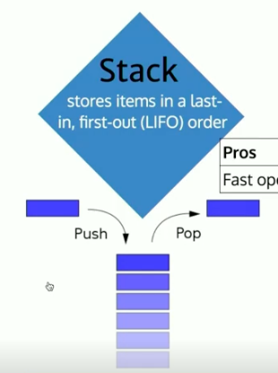

Use Cases

- JavaScript engines have a call stack
- When you hit 'undo' in your text editor or 'back' in your browser, you are using a stack

```js
class Stack {
  constructor() {
    this._storage = {};
    this._length = 0;
  }
  push(value) {
    // TODO: add typechecking and check arguments
    this._storage[this._length] = value;
    this._length++;
  }
  pop() {
    if (this._length) {
      const lastVal = this._storage[this._length - 1];
      delete this._storage[this._length - 1];
      this._length--;
      return lastVal;
    }
  }
  peek() {
    if (this._length) {
      return this._storage[this._length - 1];
    }
  }
}
```
